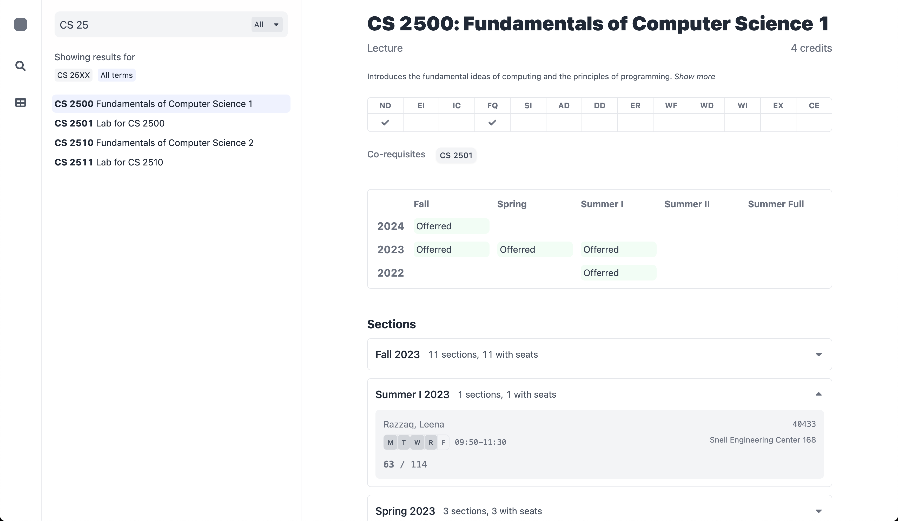
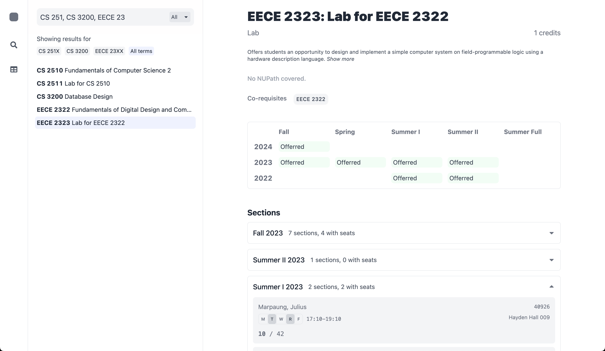
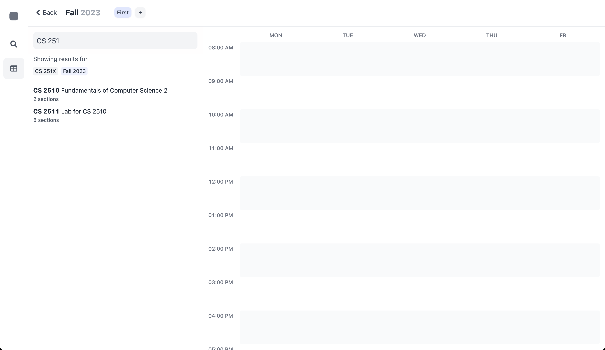
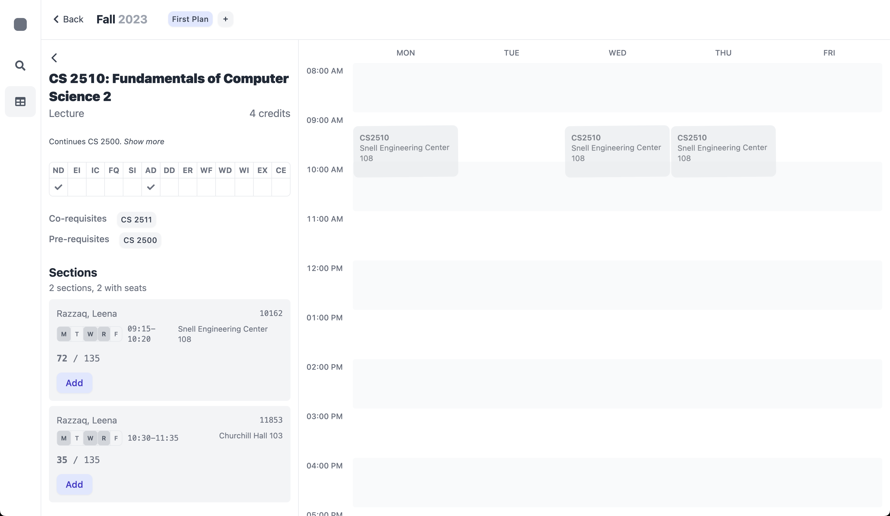

# Northeastern University Courses Planner

> Courses viewer and planner

## Images

Course search:

<p align="center"></p>
<p align="center"></p>

Semester planning:

<p align="center"></p>
<p align="center"></p>

## Planned features

### Course search

- [x] Expressive search to allow searching for multiple courses, example: `CS 25` to search for all CS 25-hundred courses, `CS3` to search for all CS three-thousand courses, `CS 3, EECE 23` to search for all `CS 3XXX` and `EECE 23XX` courses (where `X` can be any number)
- [x] View section details (seats available, professors)
- [x] Find out when courses were offered (to get an idea on what semesters courses are usually offerred in)
- [ ] Get notifications when seats/waitlist seats open up (in browser/SMS/email)
- [ ] Allow users to submit information about courses (notes, syllabus, reviews) to display in search
- [ ] Resources on finding/buying textbooks for courses (maybe look into integration with [SGA Textbook Exchange](https://neu-textbooks.glide.page/dl/6471c6))

### Semester planning

- [x] Allow creating multiple plans for semesters
- [x] Highlight conflicts 
- [ ] Allow sharing plans via CRNs in URL or QR code, example: `courses.com/plan/202410/share/10330/18969/19723/12619/11463`
- [ ] Highlight which sections in plans are full
- [ ] Suggest alternate sections if any sections are full
- [ ] Auto create plan by selecting sections given course and preferences, example: given CS 2500, CS 2501, CS 1800, CS 1802, automatically select sections from these courses to create a plan without conflicts

### Other

- [ ] User accounts to allow acessing plans from multiple devices
- [ ] Social features: find students in same classes/sections

## Development

Clone or fork the repository, then run

```bash
yarn
```

to install all dependencies. Start a local development server with

```bash
yarn dev
```

and open [localhost:3000](http://localhost:3000/) in your browser.